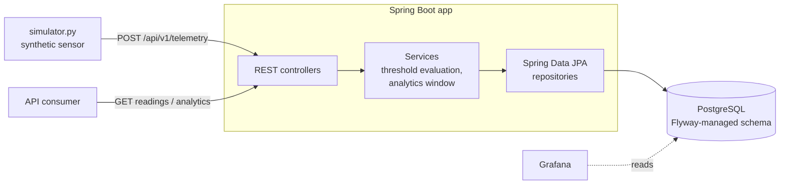

# Telemetry Hub

[](https://github.com/AdskiyPonchik/Telemetry-hub/actions/workflows/ci.yml)

An industrial IoT telemetry backend. Sensors post electrical and mechanical readings (voltage, frequency, temperature, vibration); the service validates each reading, evaluates it against global limits and per-sensor thresholds, stores it with a computed status in PostgreSQL, and exposes paginated browsing plus windowed analytics per sensor.

## Tech stack

- **Java 21**, **Spring Boot 4** (Web MVC, Data JPA, Validation, Actuator)
- **PostgreSQL 16**, schema managed by **Flyway** migrations
- **springdoc-openapi** (Swagger UI)
- **JUnit 5, Mockito, Testcontainers** integration tests, **JaCoCo** coverage
- **Docker / docker-compose**, **GitHub Actions** CI
- Python load simulator for realistic demo traffic

## Architecture



Each reading is evaluated on ingest:

| Condition | Stored status |
|---|---|
| voltage/frequency outside global limits | `ALARM` |
| temperature/vibration above the sensor's thresholds | `MECHANICAL_DAMAGE` |
| both at once | `ALARM_AND_MECHANICAL_DAMAGE` |
| everything within limits | `OK` |

Global limits live in [application.yaml](src/main/resources/application.yaml) (`telemetry.*`, validated at startup). Per-sensor thresholds come from the `sensor_configs` table, with configurable defaults for unknown sensors.

## Quick start

Requires Docker.

```bash
cp .env.example .env       # optional: adjust credentials
docker compose up --build
```

This starts PostgreSQL, the application (port 8080) and Grafana (port 3000). Then feed it data:

```bash
python -m venv venv && source venv/bin/activate && pip install requests
python simulator.py
```

The simulator posts one reading per second with a sinusoidal voltage curve and occasional injected voltage spikes.

### Run locally for development

```bash
docker compose up db       # only the database
./mvnw spring-boot:run     # dev profile, connects to localhost:5433
```

> Upgrading from a version before Flyway was introduced? Reset the database volume once
> (`docker compose down -v && docker compose up db`) so Flyway can create the schema from scratch.

## API

Interactive docs: **http://localhost:8080/swagger-ui.html**

| Method | Path | Description |
|---|---|---|
| `POST` | `/api/v1/telemetry` | Ingest a reading (validated; status computed server-side) |
| `GET` | `/api/v1/telemetry?page=0&size=20` | Paginated readings, newest first |
| `GET` | `/api/v1/analytics/{sensorId}` | Aggregated stats for the last 24h (configurable); `404` if no data |

```bash
curl -X POST http://localhost:8080/api/v1/telemetry \
  -H "Content-Type: application/json" \
  -d '{"sensorId":"MGD-PWR-01","location":"Magdeburg-Nord","voltage":260.0,"current":5.1,"frequency":50.0,"temperature":45.0,"vibration":2.5}'

curl http://localhost:8080/api/v1/analytics/MGD-PWR-01
```

```json
{
  "sensorId": "MGD-PWR-01",
  "totalReadings": 42,
  "alarmCount": 3,
  "avgVoltage": 231.7,
  "avgFrequency": 50.01
}
```

Validation failures and unknown sensors return a structured error body (`status`, `message`, `timestamp`, per-field `errors`) via a global `@RestControllerAdvice`.

## Configuration

| Property | Default | Meaning |
|---|---|---|
| `telemetry.voltage.min/max` | 198 / 242 | Global electrical limits → `ALARM` |
| `telemetry.frequency.min/max` | 49 / 51 | Global frequency limits → `ALARM` |
| `telemetry.thresholds.default-max-temperature` | 80 | Fallback for sensors without a `sensor_configs` row |
| `telemetry.thresholds.default-max-vibration` | 10 | Fallback vibration threshold |
| `telemetry.analytics.window-hours` | 24 | Analytics aggregation window |

Database credentials are supplied via environment variables (`DB_URL`, `DB_USERNAME`, `DB_PASSWORD` for local runs; see [.env.example](.env.example) for docker compose).

## Testing

```bash
./mvnw verify              # Docker required (Testcontainers)
```

- Unit tests for the threshold/status logic (Mockito)
- `@WebMvcTest` slices: validation errors, error contract, JSON mapping
- `@DataJpaTest` against a real PostgreSQL container: the JPQL aggregation, alarm counting and time-window filtering
- Full `@SpringBootTest` end-to-end flow: Flyway migration → ingest → analytics
- Coverage report: `target/site/jacoco/index.html`

## Roadmap

- [ ] Micrometer → Prometheus metrics with a provisioned Grafana dashboard
- [ ] API-key authentication for the ingest endpoint
- [ ] Async ingestion pipeline (Kafka) for burst traffic
- [ ] Data retention job for old readings

## License

Proprietary — see [LICENCE](LICENCE).
